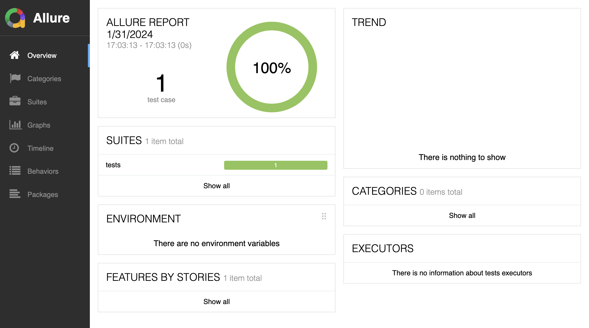

## Introduction

This repository hosts a simple example for a non-obvious case that may occur when
running tests using *pytest* and *pytest-xdist* (also involving Allure later on).

All the examples can be run using the Docker image that is provided as part of the
repository, once you build the image is built with:

```bash
docker build . -t "pytest-xdist-allure-error"
```

## No tests are run when there is a collection error…

When a *pytest* session starts, *pytest* first collects the tests in the test folder
(or `.` if there is no test folder specified). If there are errors that occur during the
collection, for instance an `import` that can't be resolved, *pytest* stops there and no
tests are run.

For instance, the `tests` directory contains two test modules: one runs fine, but the
other contains a broken `import` statement. If we run the test suite, we get the
following:

```bash
> docker run --rm pytest-xdist-allure-error
============================= test session starts ==============================
platform linux -- Python 3.12.1, pytest-8.0.0, pluggy-1.4.0
rootdir: /home
plugins: xdist-3.5.0, allure-pytest-2.13.2
collected 1 item / 1 error

==================================== ERRORS ====================================
___________________ ERROR collecting tests/test_breaking.py ____________________
ImportError while importing test module '/home/tests/test_breaking.py'.
Hint: make sure your test modules/packages have valid Python names.
Traceback:
/usr/local/lib/python3.12/importlib/__init__.py:90: in import_module
    return _bootstrap._gcd_import(name[level:], package, level)
/Users/jean/Code/pytest-xdist-allure-error/tests/test_breaking.py:1: in <module>
    ???
E   ModuleNotFoundError: No module named 'idontexist'
=========================== short test summary info ============================
ERROR tests/test_breaking.py
!!!!!!!!!!!!!!!!!!!! Interrupted: 1 error during collection !!!!!!!!!!!!!!!!!!!!
=============================== 1 error in 0.03s ===============================
Return code: 2
```

We notice the line `Interrupted: 1 error during collection`, and the fact that no tests
are run.

## … unless you use *pytest-xdist*…

This behavior is actually nice because we probably don't want to go further in the test
suite if we have import errors.

However, when running tests in parallel with *pytest-xdist*, this is not the behavior by
default. We can see that by setting the `PYTEST_XDIST_AUTO_NUM_WORKERS` environment
variable to a number greater than 0:

```bash
> docker run --rm -e PYTEST_XDIST_AUTO_NUM_WORKERS=2 pytest-xdist-allure-error
============================= test session starts ==============================
platform linux -- Python 3.12.1, pytest-8.0.0, pluggy-1.4.0
rootdir: /home
plugins: xdist-3.5.0, allure-pytest-2.13.2
created: 2/2 workers
2 workers [1 item]

.                                                                        [100%]
==================================== ERRORS ====================================
___________________ ERROR collecting tests/test_breaking.py ____________________
ImportError while importing test module '/home/tests/test_breaking.py'.
Hint: make sure your test modules/packages have valid Python names.
Traceback:
/usr/local/lib/python3.12/importlib/__init__.py:90: in import_module
    return _bootstrap._gcd_import(name[level:], package, level)
/Users/jean/Code/pytest-xdist-allure-error/tests/test_breaking.py:1: in <module>
    ???
E   ModuleNotFoundError: No module named 'idontexist'
=========================== short test summary info ============================
ERROR tests/test_breaking.py
========================== 1 passed, 1 error in 0.21s ==========================
Return code: 1
```

Now, see how we still get the collection error but it doesn't actually prevent the
working test from running, as the last line of the report tells us
(`1 passed, 1 error in 0.21s`).

Of course, we can (and should) check the return of the command, which tells us that
something went wrong but if we don't and if we don't look at the Pytest output directly
(more on that later), we might not see the issue.

## … unless you use the `-x` option

This is actually a use case that was planned by *pytest* and we can call the `-x` option
(short for `--exitfirst`) to the rescue. This option actually stops the test session as
soon as there is a failure. Passing it allows us to come back to the same behavior as
without *pytest-xdist*:

```bash
docker run --rm -e PYTEST_XDIST_AUTO_NUM_WORKERS=2 -e PYTEST_ADDITIONAL_ARGS="-x" pytest-xdist-allure-error
============================= test session starts ==============================
platform linux -- Python 3.12.1, pytest-8.0.0, pluggy-1.4.0
rootdir: /home
plugins: xdist-3.5.0, allure-pytest-2.13.2
created: 2/2 workers

==================================== ERRORS ====================================
___________________ ERROR collecting tests/test_breaking.py ____________________
ImportError while importing test module '/home/tests/test_breaking.py'.
Hint: make sure your test modules/packages have valid Python names.
Traceback:
/usr/local/lib/python3.12/importlib/__init__.py:90: in import_module
    return _bootstrap._gcd_import(name[level:], package, level)
/Users/jean/Code/pytest-xdist-allure-error/tests/test_breaking.py:1: in <module>
    ???
E   ModuleNotFoundError: No module named 'idontexist'
=========================== short test summary info ============================
ERROR tests/test_breaking.py
!!!!!!!!!!!!!!!!!!!!!!!!!! stopping after 1 failures !!!!!!!!!!!!!!!!!!!!!!!!!!!
!!!!!!!!!!!! xdist.dsession.Interrupted: stopping after 1 failures !!!!!!!!!!!!!
=============================== 1 error in 0.22s ===============================
Return code: 2
```

All is good, everyone is safe again! But wait, I told you I would tell you more about
not looking at *pytest* logs (who does that?!).

## Introducing Allure

Where the default behavior might be problematic is if you don't look at *pytest* logs.
This can be the case if you use a tool like [Allure](https://allurereport.org/) to
view your test results. In that case, you rely on it to tell you whether tests failed.
Well, can you imagine what happens if you run tests with *pytest-xdist* and that you
didn't pass the `-x` option? Let's find out:

```bash
docker run --rm -it -p 9090:9090 -e PYTEST_XDIST_AUTO_NUM_WORKERS=2 -e ALLURE_REPORT=1 pytest-xdist-allure-error
============================= test session starts =============================
platform linux -- Python 3.12.1, pytest-8.0.0, pluggy-1.4.0
rootdir: /home
plugins: xdist-3.5.0, allure-pytest-2.13.2
2 workers [1 item]     error                                                  
.                                                                       [100%]
=================================== ERRORS ====================================
___________________ ERROR collecting tests/test_breaking.py ___________________
ImportError while importing test module '/home/tests/test_breaking.py'.
Hint: make sure your test modules/packages have valid Python names.
Traceback:
/usr/local/lib/python3.12/importlib/__init__.py:90: in import_module
    return _bootstrap._gcd_import(name[level:], package, level)
/Users/jean/Code/pytest-xdist-allure-error/tests/test_breaking.py:1: in <module>
    ???
E   ModuleNotFoundError: No module named 'idontexist'
=========================== short test summary info ===========================
ERROR tests/test_breaking.py
========================= 1 passed, 1 error in 0.21s ==========================
Return code: 1
Generating report to temp directory...
Report successfully generated to /tmp/6845943324082651755/allure-report
Starting web server...
2024-01-31 16:03:14.550:INFO::main: Logging initialized @941ms to org.eclipse.jetty.util.log.StdErrLog
Can not open browser because this capability is not supported on your platform. You can use the link below to open the report manually.
Server started at <http://172.17.0.2:9090/>. Press <Ctrl+C> to exit
```

Opening up `localhost:9090`, we see that the Allure report tells us that everything is
fine, although it wasn't:



## Conclusion

There are actually a few outcomes to this:

- Read your *pytest* logs from time to time
- Allure is really nice but it might not tell you everything all the time
- You should really use the `-x` option